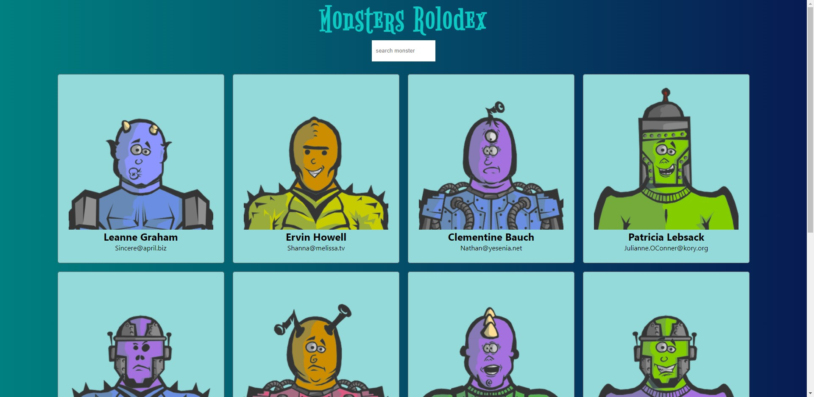

# 👾Monsters-rolodex

First react app. Learning about file structure and state on class components.
## ⚙️Features
- Connect to JSONPlaceholer and robohash APIs and render a basic grid of monsters with some data.
- Incremental search (search as you type)
## 🚀DEMO
[Monsters](https://monsters-luisca.netlify.app/)
## 👀Preview

